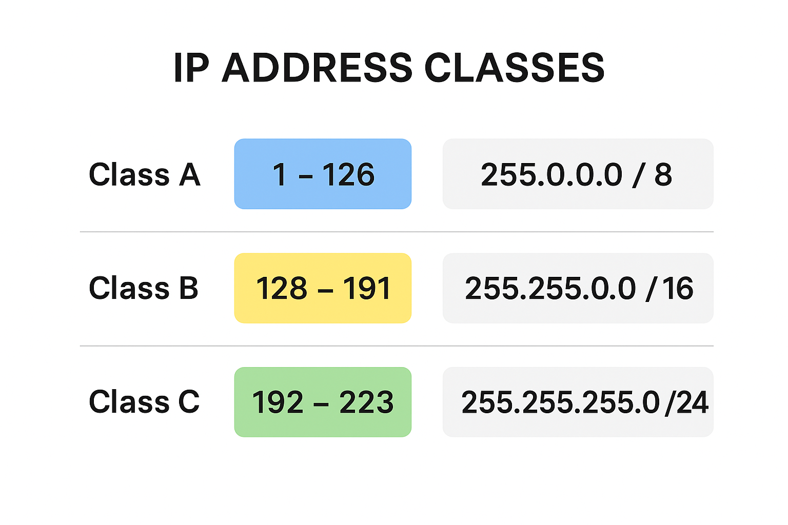

### **What is IP Addressing?**

* **IP addressing** is the system used to uniquely identify devices on a network.
* An **IP address** is a 32-bit number in IPv4 (e.g., `192.168.1.10`) that consists of:

  * **Network portion** → identifies the network
  * **Host portion** → identifies a specific device in that network

---

### **IP Address Classes (A, B, C)**

Originally, IP addresses were divided into **classes** based on the first octet. This is called **classful addressing**.

| **Class** | **Range (First Octet)** | **Default Mask**    | **Network Size** |
| --------- | ----------------------- | ------------------- | ---------------- |
| **A**     | 1 – 126                 | 255.0.0.0 (/8)      | 16,777,214 hosts |
| **B**     | 128 – 191               | 255.255.0.0 (/16)   | 65,534 hosts     |
| **C**     | 192 – 223               | 255.255.255.0 (/24) | 254 hosts        |
| **D**     | 224 – 239               | Multicast           | –                |
| **E**     | 240 – 255               | Reserved            | –                |

**Details:**

* **Class A**

  * Example: `10.0.0.1`
  * First octet 1–126
  * Huge networks (for large organizations)
* **Class B**

  * Example: `172.16.5.10`
  * First octet 128–191
  * Medium networks
* **Class C**

  * Example: `192.168.1.5`
  * First octet 192–223
  * Small networks (home, small office)

**Special:**

* `127.x.x.x` → Loopback (localhost)
* `0.x.x.x` → Reserved
* **Private ranges:**

  * 10.0.0.0 – 10.255.255.255 (Class A)
  * 172.16.0.0 – 172.31.255.255 (Class B)
  * 192.168.0.0 – 192.168.255.255 (Class C)

---

### **Why Classless now?**

* Classful system wasted IP space.
* **CIDR** (Classless Inter-Domain Routing) replaced it for flexibility (e.g., `/24`, `/28`).

--- 
### **1. Subnet Mask**

* A **subnet mask** is used to separate the **network portion** and the **host portion** of an IP address.
* It looks like this: `255.255.255.0`
* Each `255` means that octet is **part of the network**.
* Each `0` means that octet is **part of the host**.

Example:

* IP: `192.168.1.10`
* Subnet mask: `255.255.255.0`

  * **Network**: first 3 octets (192.168.1)
  * **Host**: last octet (.10)
* So all IPs from `192.168.1.0 – 192.168.1.255` belong to the same network.

---

### **2. CIDR (Classless Inter-Domain Routing)**

* CIDR is a way to **write the subnet mask in a short form**.
* Example:

  * `255.255.255.0` = `/24` (because first 24 bits are network bits)
* Formula:

  * `/p` → total addresses = `2^(32−p)`
  * Example: `/24` → 32−24=8 → `2^8 = 256` addresses.

Examples:

* `/16` = 65,536 addresses → `172.16.0.0/16` covers `172.16.0.0 – 172.16.255.255`
* `/28` = 16 addresses → `172.16.2.0/28` covers `172.16.2.0 – 172.16.2.15`

---

### **3. Public & Private Subnets**

* **Private IP ranges** (used inside internal networks, not routed on the internet):

  * `10.0.0.0 – 10.255.255.255` (10/8)
  * `172.16.0.0 – 172.31.255.255` (172.16/12)
  * `192.168.0.0 – 192.168.255.255` (192.168/16)
* **Public IPs**: Any IP outside these ranges, reachable from the internet.
* **Subnets** in AWS:

  * **Public subnet** → has a route to **Internet Gateway**
  * **Private subnet** → no direct internet route (may use NAT Gateway for outbound)